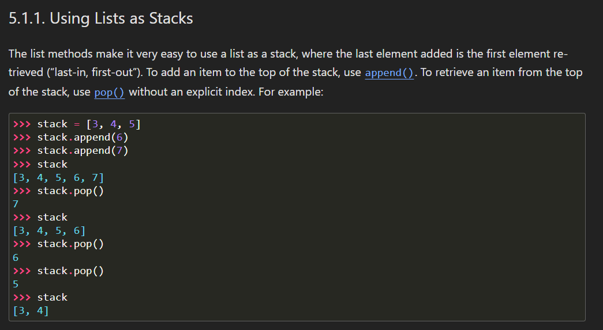
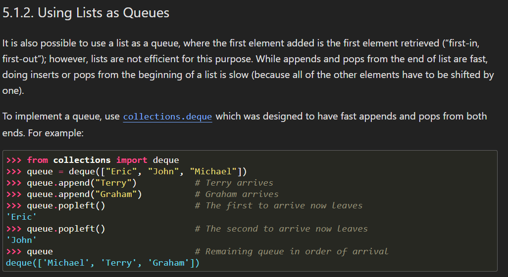

Stack = type of a group of things (think of it as horizontal group) => Because in stack, always the elements are Last-in, First-out.

Queue = type of a group of things (think of it as a verticle pile of dishes) => because in Queue, always the elements are First-in, First-out.
It is also possible to use a list as a queue, where the first element added is the first element retrieved (“first-in, first-out”); however, lists are not efficient for this purpose. While appends and pops from the end of list are fast, doing inserts or pops from the beginning of a list is slow (because all of the other elements have to be shifted by one). To implement a queue, use collections.deque which was designed to have fast appends and pops from both ends.

