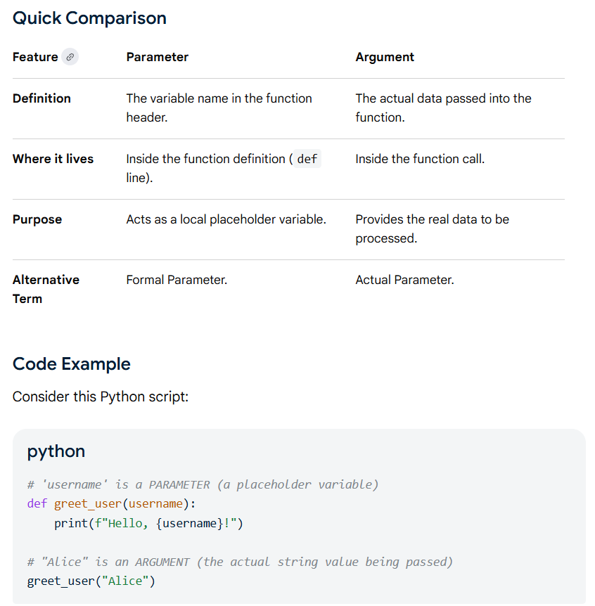

whenever a variable is called, variable references first look in the local symbol table, then in the local symbol tables of enclosing functions, then in the global symbol table, and finally in the table of built-in names.

Coming from other languages, you might object that fib is not a function but a procedure since it doesn’t return a value. In fact, even functions without a return statement do return a value, albeit a rather boring one. This value is called None (it’s a built-in name). Writing the value None is normally suppressed by the interpreter if it would be the only value written.

A parameter is the variable listed in the function definition, while an argument is the actual value passed to the function when it is called.

